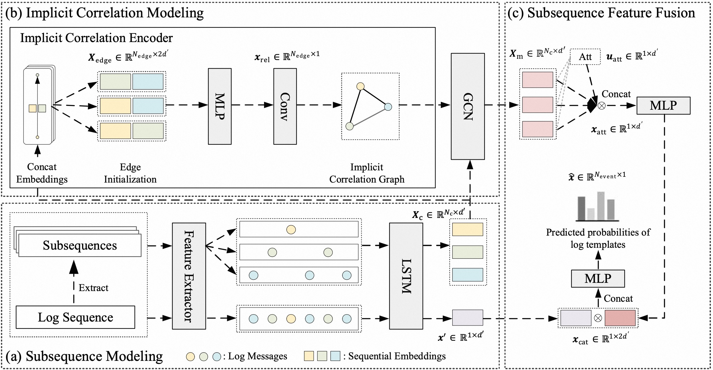

# CSCLog
This repo is the official implementation for CSCLog: A Component Subsequence Correlation-Aware Log Anomaly Detection Method.

## 1 Framework

## 2 Prerequisites
+ Python 3.9.13
+ Pytorch 1.12.0
+ sklearn, numpy, torch_geometric
## 3 Datasets
To evaluate the performance of CSCLog, we conduct experiments on four benchmark [dataset](https://github.com/logpai/loghub): HDFS, BGL, OpenStack, and Thunderbird.
### HDFS
The HDFS dataset is generated by Hadoop-based MapReduce jobs deployed on more than 2,000 Amazon’s EC2 nodes, which contains 11,175,629 log messages for 39 hours. The log sequences are extracted directly based on the `block_id` in a log message, which are manually labeled as anomaly or normal by the Hadoop domain experts.
### BGL
The BGL dataset contains 4,747,963 log messages generated by the BlueGene/L supercomputer deployed at Lawrence Livermore National Laboratory, with a time span of 7 months. Each log message in the dataset is manually labeled as anomaly or normal by the domain experts. A sliding window with the length of 10 seconds is used to extract the log sequences. Log sequences are labeled as anomaly when containing anomalous log messages.
### ThunderBird
ThunderBird is a large dataset of over 200 million log messages, generated on the ThunderBird supercomputer system at Sandia National Laboratories (SNL). We extracted 2 million continuous log messages from 9:18:40 on November 11, 2005 to 20:28:59 on November 13, 2005, with a time span of about 59 hours. Similar to BGL, each log message is manually labeled as anomaly or normal by the domain experts. A sliding window with the length of 10 seconds is used to extract the log sequences. Log sequences are labeled as anomaly when containing anomalous log messages.
### OpenStack
OpenStack is a small dataset generated by a cloud operating system with 10 compute nodes, which contains 207,636 log messages for 30 hours. The dataset is divided into two normal log files and an anomaly file. A sliding window with the length of 10 seconds is used to extract the log sequences, and the log sequence is labeled with the same label as the file.
## 4 Running
+ Install all dependencies listed in prerequisites
+ Download the dataset
+ Run the `main.ipynb` provided
## 5 Citation
Please cite the following paper if you use the code in your work:
```
@article{chen2023csclog,
  title={CSCLog: A Component Subsequence Correlation-Aware Log Anomaly Detection Method},
  author={Chen, Ling and Song, Chaodu and Wang, xu and Fu, Dachao and Li, Feifei},
  journal={arXiv preprint arXiv:xx},
  year={2023}
}
```
